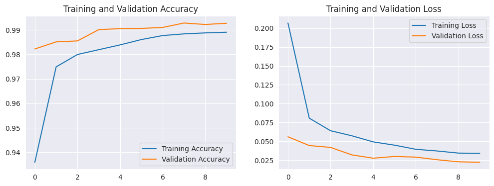

# Handwritten Digit Recognition Service

This project demonstrates an end-to-end machine learning workflow, from training a neural network to deploying it as
both an interactive web application and a robust API. The goal is to classify handwritten digits from the MNIST dataset.
Part 1: Model Training with TensorFlow & Keras

---

## Part 1: Model Training with TensorFlow & Keras

This is the foundational step where the intelligence of the application is built. A Python script handles the entire
training and evaluation pipeline.
Key Activities:

* Data Handling: The MNIST dataset, containing 70,000 images of handwritten digits, is loaded directly from TensorFlow's
  datasets library. The images are normalized by scaling their pixel values from a 0-255 range to a 0-1 range for better
  model performance.
* Model Architecture: A `Sequential` model is constructed using the Keras API. It consists of:
    - A `Flatten` layer to convert the 28x28 pixel images into a 1D array.
    - A `Dense` hidden layer with 128 neurons and a `ReLU` activation function.
    - A `Dense` output layer with 10 neurons (one for each digit) and a `softmax` activation function to output a
      probability distribution.
    - Training & Evaluation: The model is compiled with the adam optimizer and sparse_categorical_crossentropy loss
      function. It's trained for 10 epochs, and its performance is validated on a separate test set.
    - Artifact Generation: The final, trained model is saved to a file named `mnist_model.keras`, making it reusable for
      deployment.

* Training & Evaluation: The model is compiled with the `adam` optimizer and `sparse_categorical_crossentropy` loss
  function. It's trained for 10 epochs, and its performance is validated on a separate test set.
* Artifact Generation: The final, trained model is saved to a file named `mnist_model.keras`, making it reusable for
  deployment.

### Model Performance Insights

The model's performance was evaluated after training for 10 epochs.
Training History

* **Accuracy**: The training accuracy steadily increases to over 99%, while the validation accuracy remains high and
  stable at around 98%. This indicates that the model is learning effectively without significant overfitting.
* **Loss**: The training loss consistently decreases, while the validation loss flattens out, suggesting that further
  training might not yield significant improvements and could risk overfitting.

### Classification Accuracy (Confusion Matrix)

* **Overall Performance**: The confusion matrix shows excellent performance. The high values along the diagonal indicate
  that the vast majority of digits were classified correctly.
* **Minor Confusions**: There are very few misclassifications. For example, a small number of '9's were mistaken for '
  4's or '7's, and some '2's were mistaken for '7's, which are common and understandable errors due to similarities in
  handwriting.
  
  

---

## Part 2: Interactive UI with Streamlit

This component provides a user-friendly, graphical interface for interacting with the trained model.
Key Features:

* **Purpose**: To allow non-technical users to easily test the model's capabilities without writing any code.
* **Model Loading**: The application loads the `mnist_model.keras` file created in Part 1.
* **User Interaction**: A simple file uploader widget allows a user to select and upload an image of a handwritten
  digit.
* **Image Processing**: The uploaded image is preprocessed on-the-fly to match the format the model expects (grayscale,
  inverted, resized to 28x28, and normalized).
* **Results Display**: The application displays the uploaded image alongside the model's prediction. It clearly shows
  the predicted digit and the model's confidence level (probability) for that prediction.
  

---

## Part 3: Prediction API with FastAPI

This component exposes the model's prediction capabilities as a web service, allowing other programs and applications to
consume it.
Key Features:

* **Purpose**: To provide programmatic access to the model for integration into other systems (e.g., mobile apps,
  automated workflows).
* **Core** Technology: Built with FastAPI for high performance and Pydantic for robust data validation.
* **Efficient** Model Management: The lifespan manager loads the model once at startup, ensuring low-latency responses
  for all subsequent API calls.
* **API Endpoint (/predict/)**: A single POST endpoint accepts an image file and returns a structured JSON response
  containing the predicted digit, confidence score, full probability list, and prediction time.
* **Automatic Documentation**: Provides interactive API documentation via Swagger UI at the /docs endpoint, which is
  invaluable for developers looking to integrate with the API.


---
Overall Project Workflow & How to Run

1. Train the Model:
    * Run the TensorFlow training script first. This will train the neural network and produce the essential
      models/mnist_model.keras file.

2. Run the Interactive UI (Optional):
    * To use the graphical interface, run the Streamlit application:
    ```bash 
   streamlit run app.py
   ```

3. Run the API Service (Optional):
    * To expose the model as a web service, run the FastAPI application using an ASGI server:
    ```bash
    fastapi dev api
   ```